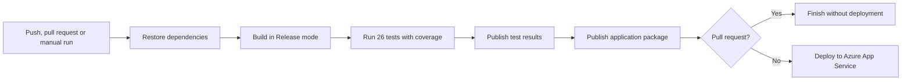

# BMI Calculator

[](https://github.com/SergiyKochenko/a00086200-bmi2026/actions/workflows/bmi_ci.yml)

I built this BMI Calculator as practice work for the **TU Dublin
Micro-credential in CI/CD (DevOps)**. It is a small ASP.NET Core Razor Pages
application that calculates an adult BMI from imperial measurements. The main
purpose of the project was to practise the complete route from writing the code
to testing it and deploying it through a CI/CD pipeline.

[View the deployed application](https://a00086200-bmi2026.azurewebsites.net)


*Figure 1: The deployed calculator ready for user input.*

## Project information

| Role | Details |
| :--- | :--- |
| Student | [A00086200@myTUDublin.ie](mailto:A00086200@myTUDublin.ie) |
| Tutor | **Gary Clynch** |
| Programme | TU Dublin Micro-credential in CI/CD (DevOps) |

## Table of contents

1. [UX and UI](#ux-and-ui)
2. [Features](#features)
3. [Technologies used](#technologies-used)
4. [DevOps implementation](#devops-implementation)
5. [Testing](#testing)
6. [Issues and troubleshooting](#issues-and-troubleshooting)
7. [Deployment](#deployment)
8. [Credits](#credits)
9. [Acknowledgements](#acknowledgements)
10. [Disclaimer](#disclaimer)

## UX and UI

### Project goals

I kept the application itself deliberately small so that I could concentrate on
the build, test and deployment process. A user should be able to:

- enter weight in stone and additional pounds;
- enter height in feet and additional inches;
- receive a BMI value and category;
- understand validation errors without losing entered values;
- use the calculator on desktop and mobile devices.

My other goal was to make the build repeatable. A push to `master` should run the
same build and tests every time before the application is deployed.

### Design

I chose a simple green, white and grey colour palette and kept the calculator in
one centred card. Weight and height are grouped separately. After a successful
calculation, the result appears in its own panel so it is easy to spot.

On a smaller screen the layout changes to one column. I also kept visible form
labels, keyboard focus styles and a separate validation message for each field.

## Features

### BMI calculation

- Accepts imperial measurements using stone, pounds, feet and inches.
- Converts the measurements to kilograms and metres before calculating BMI.
- Displays the result to one decimal place.
- Classifies the result as Underweight, Normal, Overweight or Obese.


*Figure 2: A completed calculation showing the BMI value and category.*

### Form validation

- Weight in stone must be between 5 and 50.
- Additional pounds must be between 0 and 13.
- Height in feet must be between 4 and 7.
- Additional inches must be between 0 and 11.
- A result is displayed only when every field is valid.


*Figure 3: Client-side validation prevents out-of-range measurements from being submitted.*

### Navigation and supporting pages

- Home and brand links return to the calculator.
- The Privacy page explains how submitted measurements are handled.
- The Error page gives the user a route back to the calculator and displays a
  request reference when one is available.

### Responsive layout

The form, result panel, navigation and footer adapt to desktop and mobile screen
sizes. The mobile navigation can be expanded using the keyboard or pointer.

### Continuous integration and deployment

I use the `BMI CI` GitHub Actions workflow to restore the dependencies, build the
solution, run the tests, publish their results, package the application and
deploy it to Azure App Service.

Pull requests run the build and test stages without deploying. Pushes to
`master`, and manually started workflow runs, also deploy the application.
The complete process is described in the
[DevOps implementation](#devops-implementation) section.

### Features left to implement

If I continue the project, the next improvements would be:

- an option to use metric measurements;
- a short explanation of each BMI category;
- automated browser accessibility checks in the CI workflow.

## Technologies used

- [ASP.NET Core Razor Pages](https://learn.microsoft.com/aspnet/core/razor-pages/) — web application framework.
- [C# and .NET 10](https://dotnet.microsoft.com/) — application and test code.
- HTML and CSS — page structure and responsive styling.
- [Bootstrap](https://getbootstrap.com/) — navigation and responsive utilities.
- [jQuery Validation](https://jqueryvalidation.org/) — client-side form validation.
- [MSTest](https://learn.microsoft.com/dotnet/core/testing/unit-testing-mstest-intro) — unit and application tests.
- [Coverlet](https://github.com/coverlet-coverage/coverlet) — code coverage collection.
- [GitHub Actions](https://docs.github.com/actions) — CI/CD automation.
- [Microsoft Azure App Service](https://azure.microsoft.com/products/app-service/) — application hosting.
- Git and GitHub — version control and repository hosting.

## DevOps implementation

The CI/CD pipeline runs in GitHub Actions and deploys to Azure App Service. I
keep its definition in
[`.github/workflows/bmi_ci.yml`](.github/workflows/bmi_ci.yml), which means the
pipeline changes are recorded in Git along with the application code.



### Workflow triggers

| Event | Build and test | Deploy to Azure |
| :--- | :---: | :---: |
| Pull request targeting `master` | Yes | No |
| Push to `master` | Yes | Yes |
| Manual workflow run | Yes | Yes |

A failed build or test stops the later publish and deployment steps. When all 26
tests pass, GitHub shows them in the **MS Tests** check and then deploys the
published application. The badge at the top of this README shows the latest
workflow status. The tested application code currently has 100% line and branch
coverage.

### Deployment secret

I saved the Azure publish profile as the GitHub repository secret
`AZURE_WEBAPP_PUBLISH_PROFILE`. GitHub passes it to the deployment step while the
workflow runs. The actual publish profile is not saved in the repository,
workflow file or README.


*Figure 4: The GitHub Actions repository secret used to authenticate the Azure deployment. The protected value is not displayed.*

## Testing

### Automated tests

Run the complete test suite from the repository root:

```powershell
dotnet test bmi2024.sln `
  --settings bmiUnitTestProject/coverlet.runsettings `
  --collect "XPlat Code Coverage"
```

At the time of this update, the suite contains **26 passing tests**. Coverage for
the application C# code is:

| Measurement | Result |
| :--- | :--- |
| Line coverage | 100% — 41/41 lines |
| Branch coverage | 100% — 12/12 branches |

Generated Razor code and the blocking process entry point are not included in
the coverage calculation.


*Figure 5: The generated HTML coverage report, including class-level results.*

### Test cases

| Area | Test | Expected result | Status |
| :--- | :--- | :--- | :---: |
| Calculation | Enter 12 stone, 0 pounds, 5 feet and 10 inches | BMI is displayed as 24.1 with category Normal | Pass |
| Categories | Exercise values in all four BMI ranges | Correct category is returned for each value | Pass |
| Boundaries | Use the minimum and maximum permitted measurements | Values are accepted | Pass |
| Validation | Use values outside each permitted range | A field-specific error is returned | Pass |
| Required fields | Submit without measurements | Four required-field errors are returned | Pass |
| Page model | Submit a valid model | Result display is enabled | Pass |
| Page model | Submit an invalid model | Result display remains hidden | Pass |
| Error handling | Load an error page with and without an active request | Correct request reference is selected | Pass |
| Application | Load the home page in Development and Production | HTTP 200 and expected page content | Pass |
| Privacy | Load `/Privacy` | HTTP 200 and privacy information | Pass |


*Figure 6: Boundary testing with the maximum valid value for every measurement field.*

### Manual testing

I also checked the local and deployed applications at desktop and mobile sizes.
I verified that:

- the calculator accepts valid input and returns the expected result;
- empty and out-of-range fields show useful validation messages;
- Home, Privacy and brand links work;
- the mobile navigation opens and closes correctly;
- the Privacy page contains the expected information;
- no browser console errors occur during the tested journeys.

### Code quality checks

- `dotnet format` completes successfully.
- The solution builds in Release configuration.
- The current NuGet vulnerability audit reports no vulnerable packages.
- The repository contains no embedded Azure publishing credentials.

## Issues and troubleshooting

### Issues resolved

These were the main problems I met while finishing the project:

| Issue | Resolution |
| :--- | :--- |
| Home and brand links had empty destinations | Both links now target the routed BMI page. |
| The original Privacy page contained placeholder text | It was replaced with application-specific privacy information. |
| Results depended on checking the raw HTTP method in the Razor view | Result visibility is now controlled by validated page-model state. |
| Old deployment templates referred to unrelated Azure resources | The obsolete templates were removed. |
| Azure rejected the publish profile during the first workflow run | SCM publishing was enabled, the exposed credential was rotated and the refreshed profile was stored as a GitHub Actions secret. FTP publishing remains disabled. |

### Known bugs

I have not found any remaining functional bugs in the current version.

## Deployment

### Azure deployment

I deployed the production application at:

<https://a00086200-bmi2026.azurewebsites.net>

The GitHub Actions workflow is stored in
[`.github/workflows/bmi_ci.yml`](.github/workflows/bmi_ci.yml). It uses the
repository secret `AZURE_WEBAPP_PUBLISH_PROFILE` to authenticate the deployment
without storing publishing credentials in source control.

To configure the same deployment workflow for another Azure App Service:

1. Create an Azure App Service that supports the project's .NET version.
2. Download the App Service publish profile from the Azure portal.
3. Open the GitHub repository and go to **Settings → Secrets and variables → Actions**.
4. Create a repository secret named `AZURE_WEBAPP_PUBLISH_PROFILE`.
5. Paste the complete publish profile into the secret value.
6. Update `AZURE_WEBAPP_NAME` in `bmi_ci.yml` if the App Service name is different.
7. Run the workflow manually or push a commit to `master`.

Publish profiles contain credentials and must never be committed to the
repository or included in documentation.

### Run locally

The .NET 10 SDK is required.

```powershell
git clone https://github.com/SergiyKochenko/a00086200-bmi2026.git
cd a00086200-bmi2026
dotnet restore bmi2024.sln
dotnet run --project bmi2021/bmi2026.csproj
```

Use the local address printed by `dotnet run` to open the application.

### Fork the repository

1. Sign in to GitHub and open the
   [project repository](https://github.com/SergiyKochenko/a00086200-bmi2026).
2. Select **Fork** at the top of the page.
3. Choose the account or organisation that should own the fork.
4. Select **Create fork**.

### Clone an existing fork

1. Open the fork on GitHub.
2. Select **Code** and copy the HTTPS, SSH or GitHub CLI address.
3. Run `git clone` followed by the copied address.
4. Open the newly created project directory in an editor.

## Credits

I wrote the application for this practice project. The third-party libraries in
`wwwroot/lib` keep their original licence files. Links to the main frameworks
and tools are listed in [Technologies used](#technologies-used).

## Acknowledgements

Thank you to **Gary Clynch** for his tutoring and guidance during the TU Dublin
Micro-credential in CI/CD (DevOps).

## Disclaimer

This application was created for educational practice and is not intended for
commercial use. BMI is a general screening measure and is not a medical
diagnosis. Anyone concerned about their health should seek advice from a
qualified healthcare professional.
